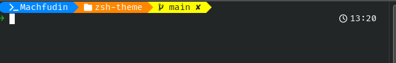

# zsh-theme

tema terminal zsh untuk ohmyzsh

## preview

### agnoster-plus

### blue-owl-plus

## requirement

- zsh
- ohmyzsh
- FiraCode Nerd Font

## install

1. clone repo
2. copy file zsh-theme.zsh ke folder ohmyzsh themes(/.oh-my-zsh/custom/themes/)
3. set zsh theme ke zsh-theme
4. install font FiraCode Nerd Font
